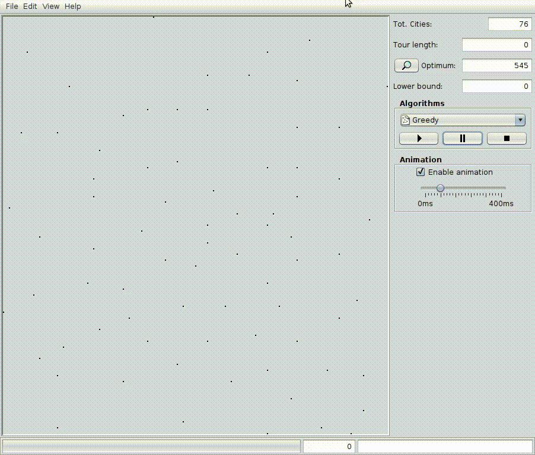

# Tspdemo

Tspdemo is a java client-side application, based on Java SE 8 and Swing.  
This app shows (in an interactive way) how the main "TSP related" heuristics works (Greedy, Nearest neighbor, Convex-Hull).  
We can test how works the approximation of sub-optimal solutions (2-opt, 3-opt) and calculate lower-bound (Held-Karp) for a given instance.  
Most of the instances of [TSPLIB95](http://comopt.ifi.uni-heidelberg.de/software/TSPLIB95/) are already preloaded. Ready to be tried.
Furthermore, there is the possibility to generate random instances.  

    

#### Build
`mvn package`

#### Launch
`java -jar tspdemo-3.0.jar`
